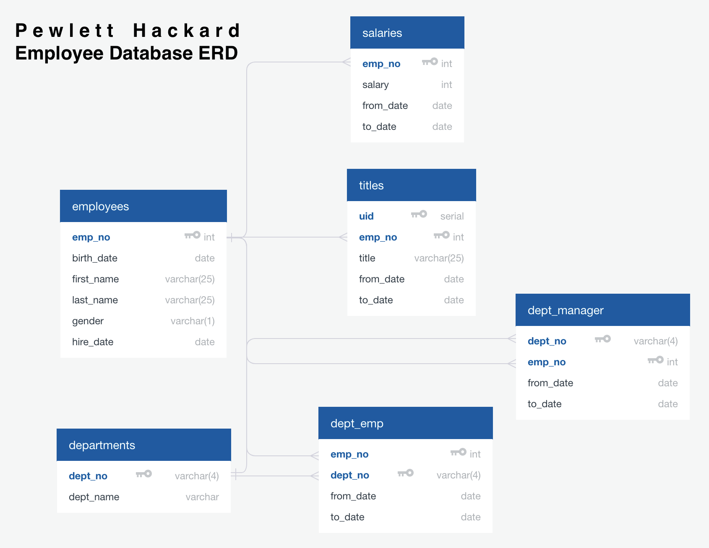
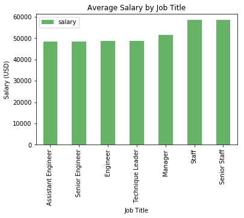

# Pewlett Hackard Employee Database Analysis

### Part 1: Rebuilding the Database
Having been provided 6 CSV files that correspond to the individual database tables, the first step was to plan the relationships between the tables. After collecting the column names within the CSVs, I mapped the data into the below ERD.

the employees and departments tables are primary to the remainder of the tables (salaries, titeles, dept_manager and dept_emp) which provide supplimental data to either one or both of the primary tables. A formatted export of the ERD was collected and applied to our Postgres database.

---

### Part 2:  Requested Queries

The SQL queries for the assignment questions can be found within the file in this repository.

---

### Part 3: Analysis

The results of some of the assignment questions were quite suspect (e.g. an alarmingly large number of people named Hercules, etc.). This being the case, I additionally averaged employee salaries by job title. Interestingly, I found that this database shows that Engineers make more on average than Senior Engineers.

Lastly, on retrieving my own supposed Employee ID, it appeared that my name was listed as "April Foolsday".

It can reasonably be determined here, that this is not a real database.